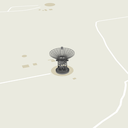
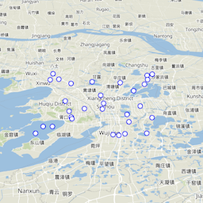
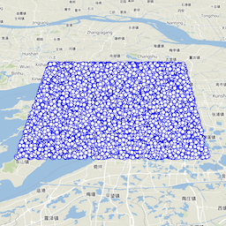
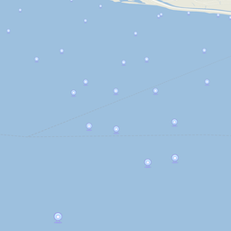
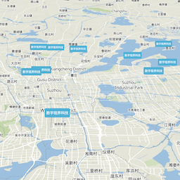
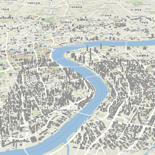
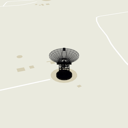

# maplibre-three-plugin

`maplibre-three-plugin` is a bridge plugin that cleverly connects [MapLibre GL JS](https://maplibre.org/maplibre-gl-js/docs/) with [Three.js](https://threejs.org/), enabling developers to implement 3D rendering and animation on maps.

## Install

```shell
npm install @dvgis/maplibre-three-plugin
----------------------------------------
yarn add @dvgis/maplibre-three-plugin
```

## Quickly Start

`maplibre-three-plugin` depends on three, please make sure three is installed before using it.

```html
<div id="map-container" ></div>
```

```javascript

import maplibregl from 'maplibre-gl'
import * as THREE from 'three'
import { GLTFLoader } from 'three/addons'
import * as MTP from '@dvt3d/maplibre-three-plugin'

const map = new maplibregl.Map({
  container: 'map-container', // container id
  style: 'https://api.maptiler.com/maps/basic-v2/style.json?key=get_access_key',
  zoom: 18,
  center: [148.9819, -35.3981],
  pitch: 60,
  canvasContextAttributes: { antialias: true },
  maxPitch: 85,
})

//init three scene
const mapScene = new MTP.MapScene(map)

//add light
mapScene.addLight(new THREE.AmbientLight())

// add model
const glTFLoader = new GLTFLoader()

glTFLoader.load('./assets/34M_17/34M_17.gltf', (gltf) => {
  let rtcGroup = MTP.Creator.createRTCGroup([148.9819, -35.39847])
  rtcGroup.add(gltf.scene)
  mapScene.addObject(rtcGroup)
})
```

## Examples
 |                                                      |                                                      |                                                           |                                                    |
 |:--------------------------------------------------------------------------------:|:--------------------------------------------------------------------------------:|:------------------------------------------------------------------------------------------------:|:----------------------------------------------------------------------------------:|
 |    [model](https://dvt3d.github.io/maplibre-three-plugin/examples/index.html)    |    [point](https://dvt3d.github.io/maplibre-three-plugin/examples/point.html)    | [point-collection](https://dvt3d.github.io/maplibre-three-plugin/examples/point-collection.html) | [billboard](https://dvt3d.github.io/maplibre-three-plugin/examples/billboard.html) |
 |                                                   |                                                   |                                                        |                                                    |
 | [div-icon](https://dvt3d.github.io/maplibre-three-plugin/examples/div-icon.html) | [3d-tiles](https://dvt3d.github.io/maplibre-three-plugin/examples/3d-tiles.html) |    [3d-tiles-osgb](https://dvt3d.github.io/maplibre-three-plugin/examples/3d-tiles-osgb.html)    | [sun-light](https://dvt3d.github.io/maplibre-three-plugin/examples/sun-light.html) |


## Docs

### MapScene

#### examples

```js
const mapScene = new MapScene(map)
```

#### creation
 - constructor(map,[options])
   - params
     - `{Map} map ` : map instance
     - `{Object} options ` : config
```js
// config
Object({
    scene: null, //THREE.Scene，if not passed in, the default scene will be used
    camera: null, //THREE.Camera, if not passed in, the default camera will be used
    renderer: null, //THREE.WebGLRenderer if not passed in, the default renderer will be used
    preserveDrawingBuffer: false,
    renderLoop: (ins) =>{} //Frame animation rendering function, if not passed in, the default function will be used，the params is an instance for MapScene
})
```

#### event hooks

- `preRest` : A hook that calls `renderer.resetState` before each animation frame
- `postRest`: A hook that calls `renderer.resetState` after each animation frame
- `preRender`: A hook that calls `renderer.render` before each animation frame
- `postRender`: A hook that calls `renderer.render` after each animation frame

#### properties

- `{maplibregl.Map} map ` : `readonly`
- `{HTMLCanvasElement} canvas ` : `readonly`
- `{THREE.Camera} camera `: `readonly`
- `{THREE.Sence} scene` : `readonly`
- `{THREE.Group} lights`: `readonly`
- `{THREE.Group} world` : `readonly`
- `{THREE.WebGLRenderer} renderer` : `readonly`

#### methods

- **_addLight(light)_**
  Add light to the scene, support custom light objects, but the custom light objects need to support the `delegate` property, and the `delegate` type is `THREE.Object3D`
    - params
        - `{THREE.Object3D | Sun | CustomLight } light `
    - returns
      - `this`

- **_removeLight(light)_**

    Remove light from the scene

    - params
      - `{THREE.Object3D | Sun | CustomLight } light `
    - returns
        - `this`
      
- **_addObject(object)_**
   
    Add an object to world，support custom object, but the custom object need to support the `delegate` property, and the `delegate` type is `THREE.Object3D`

    - params
        - `{THREE.Object3D | CustomObject} object `
    - returns
        - `this`
- **_removeObject(object)_**

   Remove an object from world

    - params
        - `{THREE.Object3D | CustomObject} object `
    - returns
        - `this`

- **_flyTo(target,[completed],[duration])_**

   Fly the map to the provided target over a period of time, the completion callback will be triggered when the flight is complete, the target needs to contain the `position` property 

    - params
      - `{THREE.Object3D | CustomObject} target `
      - `{Function} completed `: 
      - `{Number} duration `: 
    - returns
        - `this`

- **_zoomTo(target,[completed])_**

    Zoom the map to the provided target

    - params
        - `{Ojbect} target `
        - `{Function} completed `:
    - returns
        - `this`
      
- **_on(type,callback)_**
    - params
        - `{String} type `
        - `{Function} callback `:
    - returns
        - `this`

- **_off(type,callback)_**
    - params
        - `{String} type `
        - `{Function} callback `:
    - returns
        - `this`

### SceneTransform

#### examples

```js
const scale = new SceneTransform.projectedUnitsPerMeter(map)
```

#### static methods

- **_projectedMercatorUnitsPerMeter()_**
    - params
    - returns
        - `{Number} value`
      
- **_projectedUnitsPerMeter(lat)_**
    - params
       - `{Number} lat `
    - returns
        - `{Number} value`

- **_lngLatToVector3(lng, [lat], [alt] )_**
    - params
        - `{Array | Number} lng `
        - `{ Number} lat `
        - `{ Number} alt `
    - returns
        - `{THREE.Vector3} v`

- **_vector3ToLngLat(v)_**
    - params
        - `{THREE.Vector3} v`
    - returns
        - `{Array} value`

### Sun

#### examples

```js
const sun=  new Sun()
```

#### creation
- constructor()
  - params


#### properties

- `{THREE.Group} delegate ` : `readonly`
- `{Boolean} castShadow `
- `{Date || String} currentTime `
- `{THREE.DirectionalLight} sunLight` : `readonly`
- `{THREE.HemisphereLight} hemiLight`: `readonly`

#### methods

- **_update(frameState)_**
    - params
        - `{Object} frameState`: 
    - returns
        - `this` 

### Creator

#### examples

```js
const rtcGroup =  Creator.createRTCGroup([-1000,0,0])
```

#### static methods

- **_createRTCGroup(center, [rotation], [scale])_**
    - params
        - `{Array} center`
        - `{Array} rotation`: default value is [0,0,0]
        - `{Array} scale`: scale corresponding to the current latitude
    - returns
        - `{THREE.Group} rtc`

- **_createMercatorRTCGroup(center, [rotation], [scale])_**
    - params
        - `{Array} center`
        - `{Array} rotation`: default value is [0,0,0]
        - `{Array} scale`: scale corresponding to the current latitude
    - returns
        - `{THREE.Group} rtc`

- **_createShadowGround(center, [width], [height])_**
    - params
        - `{THREE.Vector3} center`
        - `{Number} width`: default value is 100
        - `{Number} height` : default value is 100
    - returns
        - `{Object} rtc`
